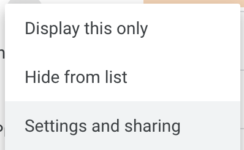
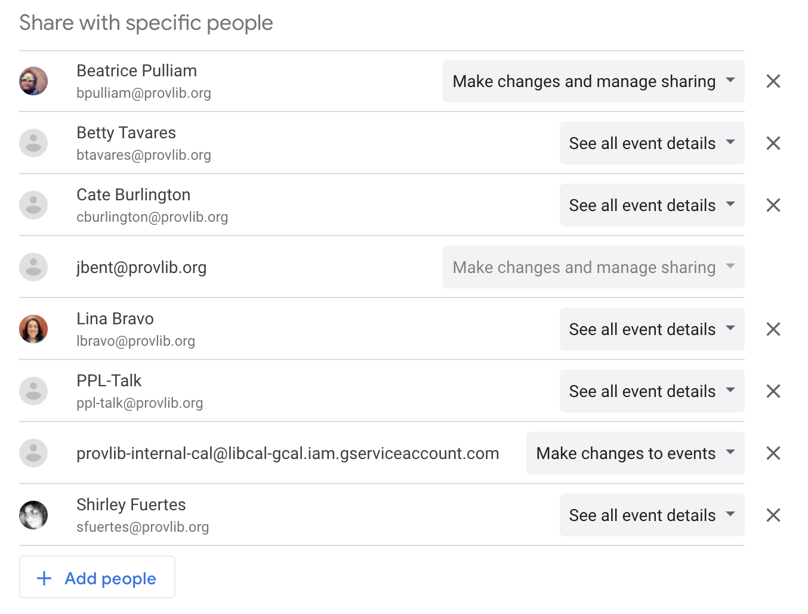

# LibCal
----
### Table of Contents

* [LibCal Admin](#libcal-admin)
* [Google Calendar Integration](#google-calendar-integration)
* [LibCal For WordPress plugin](#libcal-for-wordpress-plugin)

## LibCal Admin
---
:link: **LibCal Admin** [http://provlib.libcal.com/admin.php](http://provlib.libcal.com/admin.php)

:link: **LibCal Front End** [http://provlib.libcal.com](http://provlib.libcal.com)

:link: **LibCal Support** [https://ask.springshare.com/libcal](https://ask.springshare.com/libcal)

LibCal is a third party event calendar application Provience Public Library uses to schedule both public and private events and reserve spaces in the library for internal meetings or public events.

The private event calendar, **PPL Morins Calendar** (_calendar ID number 8193_), is used to reserve spaces in the library for internal meetings and events booked by Morins.

The front facing calendar, **PPL Public Event Calendar** (_calendar ID 8194_), is used to reserve spaces for Library Events in the physical space of the library. It is also used to add events for spaces held offsite.

The **PPL Public Event Calendar** can be viewed on LibCal or on ProvLib.org via a WordPress plugin that pulls event data out of LibCal using their API.

#### LibCal Front End Display

LibCal provides a [front end presentation of the event calendar](http://provlib.libcal.com).
There is an [admin area where you can modify/style the display of the calendar](https://provlib.libcal.com/admin_look.php?action=0). You can add custom CSS, javascript, and html code for the header and footer of the display. You can edit the look the libcal homepage, [here](https://provlib.libcal.com/admin/look-and-feel/page/9196).

You can edit the look of the event page (the page libcal displays when you are viewing a single events details) [here](https://provlib.libcal.com/admin/look-and-feel/page/8505).

LibCal also offers an "Hours Page" to display the hours of the library on the LibCal front end calendar pages. We aren't using this currently, however it can edited [here](https://provlib.libcal.com/admin/look-and-feel/page/8507).

The main customizations I made to the front end display of LibCal was adding code to the header and footer and adding some global css for those sections. That code is all [available here](https://provlib.libcal.com/admin_look.php?action=0).

#### LibCal Event Registrations

The main thing we use the LibCal front end for is event registrations. We display information about events, and various types of event listings on [ProvLib.org](https://www.provlib.org/calendar). If an event has limited seating, or we want to track who is attending, we use LibCal's event registration forms. Those can be set in the calendar admin when you add a new event.  We don't have anyway of allowing registrations on ProvLib.org, so the calendar areas on ProvLib.org link out to the individual event page on LibCal. Those pages contain the event registration forms.

[Here's an example of an event page on ProvLib.org](https://www.provlib.org/calendar/?id=5285327&d=2019-09-03).

[Here is what the LibCal Front End page with a registration form looks like for that event](https://provlib.libcal.com/event/5285327).

#### Adding New Event in Libcal

You mostly don't need to handle adding events. Tonia and other people in the organization handle adding or editing events via LibCal's admin. You may be called on to debug issues with events once they are added, or help to edit them.

[Here is the LibCal support section on Calendars and Events](https://ask.springshare.com/libcal/search/?t=0&adv=1&topics=Calendars%20%26amp%3B%20Events).

You'll find tutorials on adding events, editing events, using the bulk import option for adding events.

## Google Calendar Integration
---

LibCal offers the ability to sync event calendars to an organizations Google Calendar. This is currently set-up and working, however occasionally a someone will have an issue getting the PPL Morins or Public Event calendar to display, or events that have been edited won't sync to the Google Calendar. [Here are instructions on how to sync a LibCal calendar to Google Calendar](https://provlib.libcal.com/calendar_gsync.php?cal_id=8194).

**If a staff member can't see the PPL Morins calendar or the PPL Public Event calendar in Google Calendar**

The easiest thing to do is to send them a link to the calendar. Follow these steps:

1. Find the **PPL Morins** or **PPL Public** calendar in the Google Cal siderail navigation. 
2. Select the calendar you want to share and click the veritcal dots icon **&vellip;** then select **Settings and sharing** 
3. Find the **Share with specific people** option. Click the **+ Add people** button. Add the email address(es) of the individual(s) in the org who need access. 
4. An email will be sent to those people added with a link to the calendar. After clicking the link the calendar should be accessible via the **My calendars** siderail option.

**Events not synching after editing/deleting**

This most likely won't be an issue going forward, however, if this does pop up as an issue here is the likely cause and how to fix the problem.

1. **Events added in bulk via the [event importer](http://provlib.libcal.com/admin/event-import) don't sync with Google Calendar**, even when edited. This is a bug with LibCal. **Events that are manually added using the Add New Event form do sync**, as do edits to those events.
2. If an event is not syncing after edit it is most likely an event added using bulk import. To get the event to sync to Google Calendar you need to create a new event via the **Add New Event form**, copy the details of the event that is not syncing, then delete the old event.

## LibCal For WordPress
---
